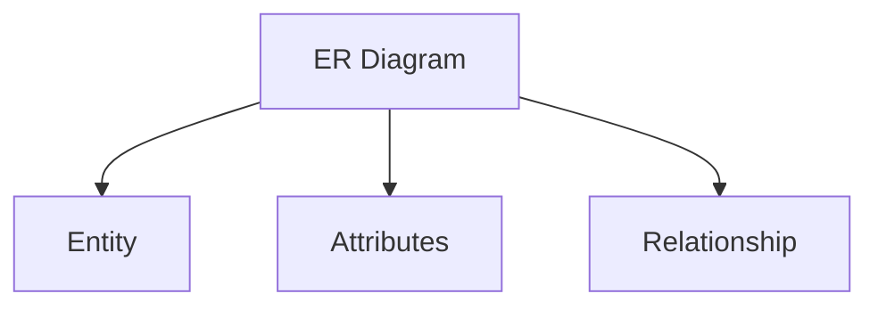

# h1 Title

This is a some random text to display how this theme will look on ==Typora==. It has a lot of great support for things like inline code `System.out.println("Typora")`. It has support [^fn1] for inline math like most themes, so you can do things like $\prod _{\text{name}} (\sigma_{\text{dept\_name = "Physics"}}(instructor))$ . You can highlight text that is important by doing ==shift-command-H==

<!--This is what a comment looks like-->

## h2 Title

- First level list
  - Second level List
    - Third level List
  - Back to second level

- [ ]  TODO 1
  - [x]  TODO 2

### h3 Heading

```c
#include <stdio.h>
int main(int argc, char *argv[]){
  int x = 1;
  printf("This is a code segment, %d", x);
  return 0;
}
```

- [ ] Change the color of the yellow in the code segment

#### h4 Heading

| Table  | Table  | Table  |
| ------ | ------ | ------ |
| Column | Column | Column |



##### h5 heading

[^fn1]:  footnote 1

